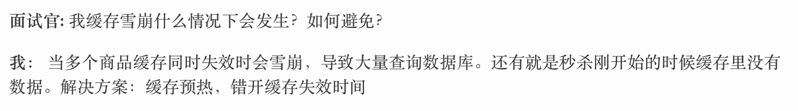
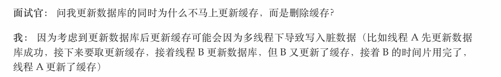

#  Redis、memcache、MongoDB 对比。

 mongodb 和 memcached 不是一个范畴内的东西。mongodb 是文档型的非关系 型数据库，其优势在于查询功能比较强大，能存储海量数据。

 和 memcached 更为接近的是 Redis。它们都是内存型数据库，数据保存在内存 中，通过 tcp 直接存取，优势是速度快，并发高，缺点是数据类型有限，查询功能不 强，一般用作缓存。

1. 性能 Redis 和 memcache 差不多，要大于 mongodb。

2. 操作的便利性 memcache 数据结构单一。 Redis 丰富一些，数据操作方面，Redis 更好一些，较少的网络 IO 次数。 mongodb 支持丰富的数据表达，索引，最类似关系型数据库，支持的查询语 言非常丰富

3. 内存空间的大小和数据量的大小 Redis 在 2.0 版本后增加了自己的 VM 特性，突破物理内存的限制；可以对 key value 设置过期时间（类似 memcache）。 memcache 可以修改最大可用内存, 采用 LRU 算法。 mongoDB 适合大数据量的存储，依赖操作系统 VM 做内存管理，吃内存也 比较厉害，服务不要和别的服务在一起。 

4. 可用性（单点问题） Redis 对于单点问题，依赖客户端来实现分布式读写；主从复制时，每次从节 点重新连接主节点都要依赖整个快照, 无增量复制，因性能和效率问题，所以 单点问题比较复杂；不支持自动 sharding, 需要依赖程序设定一致 hash 机 制。一种替代方案是，不用 Redis 本身的复制机制，采用自己做主动复制 （多份存储），或者改成增量复制的方式（需要自己实现），一致性问题和性 能的权衡。 Memcache 本身没有数据冗余机制，也没必要；对于故障预防，采用依赖成 熟的 hash 或者环状的算法，解决单点故障引起的抖动问题。 mongoDB 支持 master-slave,replicaset（内部采用 paxos 选举算法，自 动故障恢复）,auto sharding 机制，对客户端屏蔽了故障转移和切分机制。 

5. 可靠性（持久化） 对于数据持久化和数据恢复，Redis 支持（快照、AOF）：依赖快照进行持久 化，aof 增强了可靠性的同时，对性能有所影响。 memcache 不支持，通常用在做缓存, 提升性能； MongoDB 从 1.8 版本开始采用 binlog 方式支持持久化的可靠性。 

6. 数据一致性（事务支持） Memcache 在并发场景下，用 cas 保证一致性。 Redis 事务支持比较弱，只能保证事务中的每个操作连续执行。 mongoDB 不支持事务。 

7. 数据分析 mongoDB 内置了数据分析的功能 (mapreduce), 其他不支持。 

8. 应用场景 Redis：数据量较小的更性能操作和运算上。

   ​	 memcache：用于在动态系统中减少数据库负载，提升性能; 做缓存，提高性 能（适合读多写少，对于数据量比较大，可以采用 sharding）。

   ​	 MongoDB: 主要解决海量数据的访问效率问题。 

   # Redis 有什么用？只有了解了它有哪些特性，我们在用的时候才能扬长避短，为我们所 用。

   1. 速度快：使用标准 C 写，所有数据都在内存中完成，读写速度分别达到 10 万 / 20 万。
   2. 持久化：对数据的更新采用 Copy-on-write 技术，可以异步地保存到磁盘 上，主要有两种策略，一是根据时间，更新次数的快照（save 300 10 ）二是 基于语句追加方式 (Append-only file，aof) 。 
   3. 自动操作：对不同数据类型的操作都是自动的，很安全。 
   4. 快速的主 -- 从复制，官方提供了一个数据，Slave 在 21 秒即完成了对 Amazon 网站 10G key set 的复制。
   5. Sharding 技术： 很容易将数据分布到多个 Redis 实例中，数据库的扩展是 个永恒的话题，在关系型数据库中，主要是以添加硬件、以分区为主要技术形 式的纵向扩展解决了很多的应用场景，但随着 web2.0、移动互联网、云计算 等应用的兴起，这种扩展模式已经不太适合了，所以近年来，像采用主从配 置、数据库复制形式的，Sharding 这种技术把负载分布到多个特理节点上去 的横向扩展方式用处越来越多。

# 

## Redis 和Memcache技术选型

 Redis支持持久化，支持的数据类型更多，

## Redis 和MongoDB技术选型

## Redis为什么这么快

纯内存操作， 单线程没有锁，IO多路复用技术 异步非阻塞 

### 疑点什么时候Redis不是单线程的

## Redis持久化方式

RDB

AOF

生产上redi持久化方案  

两者同时开启 

## Redis集群

集群模式

哨兵模式

## 缓存雪崩与缓存击穿、缓存穿透区别

## 

## [Redis的7个应用场景](http://www.cnblogs.com/NiceCui/p/7794659.html)

1. 缓存热数据
2. 计数器
3. 队列
4. 位操作（大数据处理）
5. 分布式锁与单线程机制
6. 最新列表
7. 排行榜

# 一致性哈希

#  
[那些年用过的Redis集群架构（含面试解析）](https://mp.weixin.qq.com/s/8H-Hd169s5Hlwn5F2ec25A)